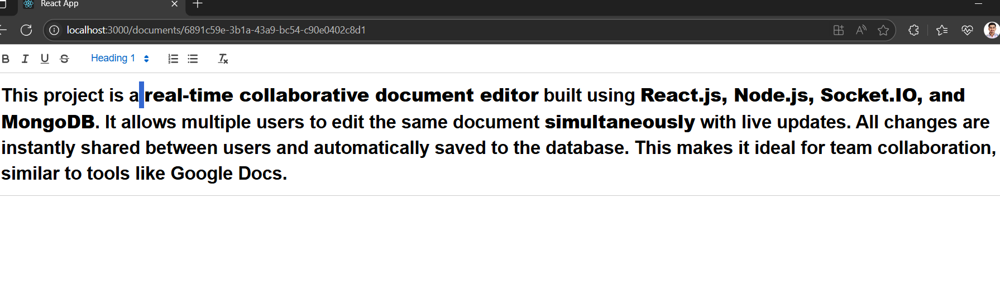

# 📝 Real-Time Collaborative Document Editor
## 🧑‍💻 Author
- COMPANY : CODTECH IT SOLUTIONS
- NAME : SUKHDEV
- INTERN ID : CT08DL212
- DOMAIN : FULL STACK WEB DEVELOPMENT
- BATCH DURATION : April 30th,2025 TO June 30th,2025
- MENTOR NAME : Neela Santhosh

A full-stack real-time collaborative document editor using:
- ⚛️ React (with Quill rich text editor)
- 🔌 Socket.IO (for live collaboration)
- 🖥️ Node.js + Express (backend)
- 🗃️ MongoDB (document persistence)

---

## 📁 Project Structure
``` pgsql
collab-editor/
├── backend/        # Node.js + Express + MongoDB
│ └── server.js
│
├── frontend/       # React + Quill Editor
│ ├── src/
│ │ ├── App.js
│ │ ├── TextEditor.js
│ │ └── index.js
│ └── public/
│
├── screenshorts/
│  └── preview
│
├── README.md
```

## 🚀 Getting Started

### 1️⃣ Clone the Repository

```bash
git clone https://github.com/your-username/collab-editor.git
cd collab-editor
```

### 2️⃣ Setup Backend
```bash
cd backend
npm install
```

### 📦 Install backend dependencies
- express
- mongoose
- socket.io
- cors
```bash
npm install express mongoose socket.io cors
```

### ▶️ Start backend
```bash
node server.js
```

### 3️⃣ Setup Frontend
```bash
cd ../frontend
npm install
```
### 📦 Install frontend dependencies
```bash
npm install react-router-dom socket.io-client react-quill uuid
```
  ⚠️ If you face dependency errors, use:

```bash
npm install --legacy-peer-deps
```

### ▶️ Start frontend
```bash
npm start
```
## 🌐 Usage
1. Open http://localhost:3000
2. A new document ID will be generated.
3. Share the URL with a friend to start collaborating in real time!
4. All changes are saved automatically to MongoDB.

## 🛠 Technologies Used
- Frontend: React, React Router, Quill, Socket.IO Client
- Backend: Node.js, Express, Socket.IO
- Database: MongoDB + Mongoose

## 📷 Screenshots
Real-time collaboration and autosave to database


## 📦 Deployment 
You can deploy:
- Frontend: Vercel / Netlify
- Backend: Render / Railway
- MongoDB: MongoDB Atlas


## 📝 License
Free to use and modify for learning purposes.  
Created for internship practice 🚀  


